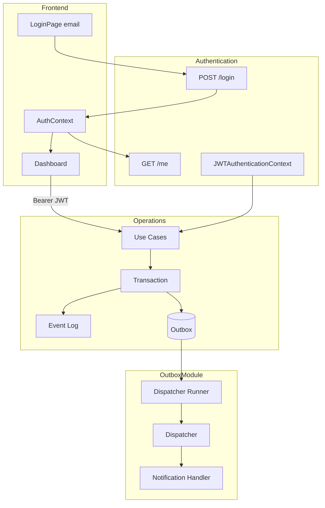

# Architecture Review — Release Candidate Hardening

**Versión:** `0.18.0-alpha`  
**Fecha:** 2026-07-15  
**Alcance:** RC Hardening PR1–PR6 — versión, login JWT, frontend auth, protección Operations, Outbox Dispatcher, documentación.  
**Restricción:** sin cambios de dominio en Operations; sin passwords, roles, refresh tokens ni delivery real de notificaciones.

---

## Objetivo

Cerrar la brecha entre el **Walking Skeleton demostrable** (Sprint 18) y una **Release Candidate etiquetable**, alineando seguridad, outbox y documentación con el comportamiento real del código.

| PR | Entregable |
|----|------------|
| PR1 | Alineación de versión (`ApplicationConfig`, Health, tests, docs) |
| PR2 | `POST /api/v1/authentication/login` |
| PR3 | Frontend login integrado (email → JWT → `/me`) |
| PR4 | Operations protegidas con `JwtAuthenticationGuard` |
| PR5 | Outbox Dispatcher (`OutboxModule`) |
| PR6 | Documentación final RC |

---

## Veredicto

**Release Candidate `0.18.0-alpha` aprobada para etiquetar.**

Un operador puede:

1. Levantar backend + PostgreSQL + frontend (`docs/GUIA_USO.md`).
2. Iniciar sesión con email en `/login`.
3. Acceder al Dashboard con JWT válido.
4. Refrescar el navegador y mantener sesión.
5. Invocar la API Operations solo con autenticación.
6. Confiar en que los Domain Events escritos en Outbox serán consumidos por el dispatcher (pipeline MVP).

El sistema **no está listo para producción pública** sin resolver deuda P1 estructural documentada en `architecture_backlog.md` (VOs duplicados, Event Log incompleto, concurrencia optimista, etc.).

---

## Estado post-hardening

### Seguridad y autenticación

```
POST /authentication/login     → público (email → JWT)
POST /authentication/users     → público
GET  /authentication/users/:id → público
GET  /authentication/me        → JWT requerido
GET  /api/v1/operations/*      → JWT requerido (todos los controllers)
GET  /health, /info, /docs     → públicos
```

- Un solo mecanismo: `JWTAuthenticationContext` + `JwtAuthenticationGuard`.
- Sin guards duplicados, sin validación JWT paralela.
- OpenAPI refleja Bearer en Operations; login y auth públicos con `security: []`.

### Frontend

- Login por email (no JWT manual).
- `AuthContext.login()` → token → `GET /me` → usuario en sesión.
- `authenticatedApiClient` adjunta Bearer automáticamente.
- Vitest: 8 tests (login, 401, logout, `ProtectedRoute`).

### Transactional Outbox

```
Use Case → Transaction → Event Log + Outbox (pending)
                              ↓
                    OutboxDispatcherRunner (poll 5s)
                              ↓
                    OutboxDispatcher → OutboxProcessor
                              ↓
                    NotificationOutboxHandler (MVP)
                              ↓
                    processed | failed | retry (max 3)
```

- Módulo `src/outbox/` **no importa dominio** Operations.
- Handlers pluggables: extensible a Email, Webhook, Integraciones.
- Migración `011_outbox_dispatch.sql`: `retry_count`, `last_error`.
- Runner deshabilitado en `NODE_ENV=test`.

---

## Fortalezas verificadas

1. **RC E2E real** — login frontend conectado a backend; no dependencia de JWT pegado.
2. **Superficie API coherente** — Operations protegida; endpoints de sistema públicos.
3. **Outbox funcional** — write path existente + dispatch path nuevo; patrón completo.
4. **Desacoplamiento outbox** — dispatcher procesa mensajes genéricos, no Incident ni Notification domain.
5. **Versión unificada** — `0.18.0-alpha` en código, Health, Info, Swagger, tests y docs.
6. **Cobertura ampliada** — 70 suites backend (658 tests) + 2 suites frontend (8 tests).
7. **Clean Architecture preservada** — hardening solo en infrastructure HTTP, auth y outbox; dominio intacto.

---

## Deuda que permanece (P1 activa)

Sin cambios respecto al backlog canónico. Prioridad inmediata post-RC:

| # | Ítem | Impacto |
|---|------|---------|
| 1 | Event Log incompleto (`workflow.flow.detected` sin `assetId`/`shiftId`/`actorId`) | Replay y reconstrucción |
| 2 | Integridad referencial asimétrica | Referencias fantasma |
| 3–4 | `SiteId` / `ActorId` duplicados | Identidad rota entre agregados |
| 5 | Concurrencia optimista ausente | Last-write-wins en transiciones |
| 7 | Errores de dominio → 500 | Semántica HTTP inconsistente |

Ver `docs/architecture_backlog.md` para el listado completo P1/P2.

---

## Deuda resuelta en RC Hardening

| Ítem | PR |
|------|-----|
| Health desincronizado (`0.13.0-alpha`) | PR1 |
| Tests de versión fallando | PR1 |
| JWT manual en frontend | PR3 |
| Operations API pública sin auth | PR4 |
| Outbox write-only sin consumidor | PR5 |
| Sin tests frontend | PR3 (Vitest mínimo) |
| Sin `POST /login` | PR2 |

---

## Métricas de verificación

| Métrica | Valor |
|---------|-------|
| Backend tests | 70 suites — 658 tests — 0 fallos |
| Frontend tests | 2 suites — 8 tests — 0 fallos |
| Backend build | OK |
| Frontend build | OK |
| Versión | `0.18.0-alpha` unificada |
| Migraciones | `001`–`011` (+ auth `001`) |

---

## Diagrama — RC completa



---

## Recomendación de etiquetado

```bash
git tag -a v0.18.0-alpha -m "Release Candidate 0.18.0-alpha"
```

Pre-requisitos verificados:

- [x] Versión coherente en código y documentación
- [x] Login E2E funcional
- [x] Operations protegida
- [x] Outbox dispatcher operativo
- [x] Suite de tests verde
- [x] `GUIA_USO.md` disponible
- [x] Architecture Review final (este documento)

---

## Referencias

- Auditoría pre-hardening: `docs/architecture_reviews/release_candidate_audit.md`
- Sprint 18 frontend: `docs/architecture_reviews/sprint_18_frontend_foundation.md`
- Estado operativo: `docs/05_current_status.md`
- Deuda: `docs/architecture_backlog.md`
- Changelog: `docs/CHANGELOG.md`
